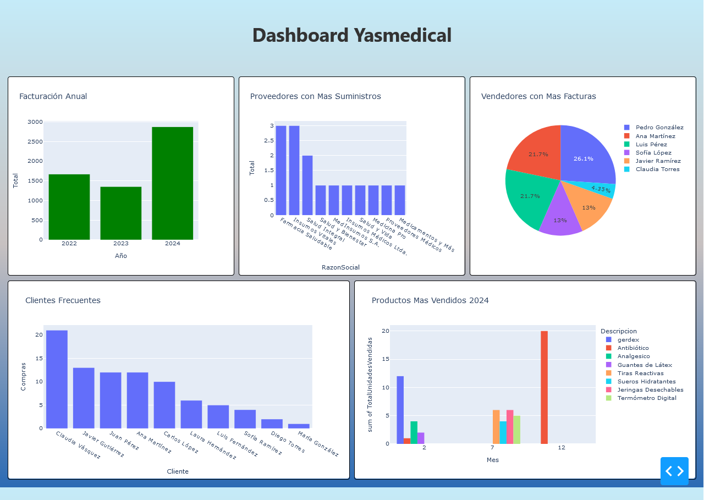

# YasmedicalDashboard

Aplicacion desarrollada en python para ilustrar un dashboard de una empresa dedicada a la distribucion de insumos medicos llamada Yasmedical.

## Requisitos

- Python 3.12
- pip (gestor de paquetes de Python)

## Instalación

### Opción 1: Usar el script

Puedes lanzar la aplicación utilizando el script proporcionado. Dependiendo de tu sistema operativo, puedes usar uno de los siguientes scripts:

- Para Windows, ejecuta el script PowerShell:
  ```powershell
  .\run.ps1

- Para Windows tambien, como alternativa a Powershell usando el cmd
  ```cmd
  .\run.bat
  
- Para Linux, otorga los permisos y ejecuta el script Shell:
  ```bash
  chmod +x Run.sh
  ./run.sh


